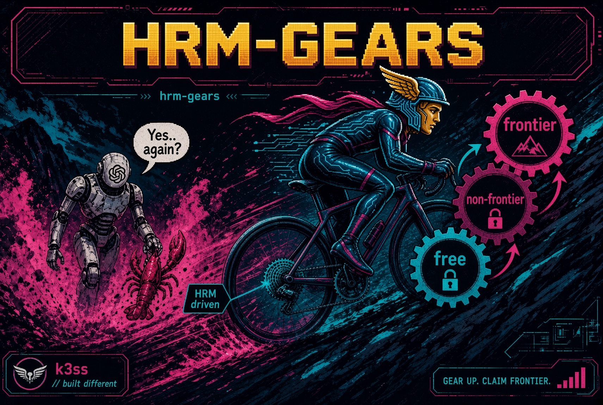

<p align="center">
  
</p>

# hrm-gears

**Adapt Sapient's 27MM (thats million NOT billion) Hierarchical Reasoning Model into a local, cheapest-viable model router.**

This is not a Transformer project. HRM (Wang et al., 2025) is a dual-timescale
recurrent network with an ACT halt head. We are measuring whether that
architecture can sit in front of a tool-using agent harness and pick the
lowest-cost model that can still do the subtask.

The MVP candidate is **Hermes Agent** ([@NousResearch](https://x.com/NousResearch)). The interface is a
capability matrix plus a discrete choice — any harness that can annotate a
subtask and honour a model id can point at the same unit. Hermes Agent is the
design centre, not a hard dependency.

Pre-work was not "stay on Transformers because they are easy". Survey
included Inception **Mercury 2** (diffusion LM), **Sakana AI**
([sakana.ai](https://sakana.ai/) — Fugu / Namazu API), and TRM. HRM is the
line known longest: dual timescale plus an ACT halt head already looks like
a monitor that *allots* work. Routing is allocation under trained
parameters, not an essay. See [`docs/architecture.md`](docs/architecture.md#pre-work).

The original research code, paper, and checkpoints are **Sapient Intelligence's**.
They are cited in [`NOTICE`](NOTICE) and [`docs/REFERENCES.md`](docs/REFERENCES.md).
This repository is an Apache-2.0 derivative: their tree, plus a documented
Apple-Silicon runtime, inference harnesses, and a routing contract.

```
rider  = Hermes orchestrator
bike   = the agent harness
gears  = vendor models (free → frontier API)
derailleur  = HRM driven(candidate)
```

Repo: [`k3ss-official/hrm-gears`](https://github.com/k3ss-official/hrm-gears).
The Python package import is `hrm_gears`.

## Install — three doors

Hero path: clone, `cd`, `./setup`. On a terminal it is **interactive** —
it probes the box, prints the command it will run, and pauses if
something is missing (`Python 3.12 is missing. Install? [Y/n]`). `--yes`
is unattended (Door 3 / CI).

### Door 1 — `./setup` (default)

```bash
git clone https://github.com/anwhelan01/hrm-gears.git
cd hrm-gears
./setup
```

Creates or reuses `.venv` with Python 3.12, installs torch + the SDPA
shim, fetches published checkpoints, runs smokes. Offers to install
3.12 (Homebrew, apt, or uv) when the probe fails. `--sudoku` skips
Maze + ARC-2 (~2.2 GiB).

### Python 3.12 (manual)

`./setup` will offer this. Use the recipes if you prefer to install the
interpreter yourself, or if you declined the prompt.

Confirm: `python3.12 --version`.

macOS (Homebrew) — generic:

```bash
brew install python@3.12
export PATH="$(brew --prefix python@3.12)/bin:$PATH"
```

macOS (miniforge / conda-forge) — the measured M4 interpreter is
3.12.11 at this prefix:

```bash
export PATH="/opt/homebrew/Caskroom/miniforge/base/bin:$PATH"
# first time only, if that python3.12 is missing:
#   brew install --cask miniforge
#   conda install python=3.12
```

Linux (Ubuntu / Debian):

```bash
sudo apt update
sudo apt install python3.12 python3.12-venv
```

Any OS ([uv](https://docs.astral.sh/uv/)):

```bash
curl -LsSf https://astral.sh/uv/install.sh | sh
uv python install 3.12
export PATH="$(dirname "$(uv python find 3.12)"):$PATH"
```

### Door 2 — techie manual

Same steps, unwrapped. Use this when you already have a venv or you are
debugging one stage.

```bash
./scripts/bootstrap_env.sh
source .venv/bin/activate
python scripts/fetch_checkpoints.py
python scripts/smoke_test_inference.py          # Sudoku ACT
python scripts/smoke_test_all.py                # Maze + ARC-2, A vs B
```

CUDA + FlashAttention reproduction of the *paper* follows the upstream
README at [`docs/upstream/HRM.README.md`](docs/upstream/HRM.README.md).
Do not mix those numbers with SDPA/MPS runs.

### Door 3 — Docker one-shot

Same `./setup`, inside a container (**CPU**). The image is the install
door, not the Twin-T4 harvest pack.

```bash
docker compose run --rm setup
```

Same `./setup --yes` inside `python:3.12-slim`. Host Python is not used.
Linux `.venv` and checkpoints live in Compose named volumes
(`hrm-gears_venv`, `hrm-gears_checkpoints`) so a host M4 `.venv` is not
overwritten.

GPU pack / harvest is **not** this image:
[`scripts/kaggle/`](scripts/kaggle/) and [`docs/compute.md`](docs/compute.md).

## MVP vs Stage 2

| | **MVP (this tree, now)** | **Stage 2 (not this PR)** |
| --- | --- | --- |
| What ships | Load published 27M weights. `./setup` (and Door 3). Frozen vendor matrix. Sudoku + Maze + ARC-2 smokes. Synthetic allotment JSONL at [`data/routing/v1/`](data/routing/v1/). | Routing classification head. Experience flywheel. Twin-T4 *training* harvest. Daily model-intel scrape. Live Hermes traces. |
| Matrix | Hard-coded snapshot. Manual refresh. | Re-rank from live catalogs; infrequent retrain. |
| Training | **Not started. Do not implement.** | Supervised bootstrap on synthetic + Hermes traces, then continual log→update with a held-out suite. |
| Daily scrape | **Out of scope.** | Lightweight freshness, then closed loop. |

The published puzzle weights do **not** route LLMs. They prove the
architecture can do hierarchical discrete search from little data.
Adaptation is Stage 2.

The M4 is the smoke bench. Training uses **Twin-T4 harvest** on Kaggle
**GPU T4 x2** — pack / spin / run / harvest / kill. See
[`docs/compute.md`](docs/compute.md).

## MVP vendor / model table

Locked sources only. Strict order: **free → non-frontier subscription →
frontier subscription → non-frontier API → frontier API**. Within a tier,
cheaper / faster wins. Machine-readable copy:
[`config/model_matrix.v1.yaml`](config/model_matrix.v1.yaml).

Vendors: **OpenCode Go**, **Nous Portal**, **OpenAI OAuth**, **OpenCode Zen**,
**Nvidia**, **OpenRouter**. Nothing else in MVP.

| Tier | ID | Source | Notes |
| --- | --- | --- | --- |
| 1 Free | `free-opencode-zen` | OpenCode Zen | Primary free lane |
| 1 Free | `free-openrouter` | OpenRouter | Rotating $0 pool |
| 1 Free | `free-nous` | Nous Portal | Temporary free windows |
| 2 Non-frontier sub | `nous-deepseek` | Nous Portal | Cheap reasoning |
| 2 Non-frontier sub | `nous-nemotron` | Nous Portal | Coding / general |
| 2 Non-frontier sub | `nous-qwen` | Nous Portal | Qwen3-class |
| 2 Non-frontier sub | `nous-hy3` | Nous Portal | Mid fill |
| 2 Non-frontier sub | `openai-nonfrontier` | OpenAI OAuth | Mini / non-Sol class |
| 3 Frontier sub | `openai-gpt56-sol` | OpenAI OAuth | High-end reasoning |
| 3 Frontier sub | `nous-fable5` | Nous Portal | Agentic |
| 3 Frontier sub | `nous-gemini` | Nous Portal | Long context / multimodal |
| 3 Frontier sub | `opencode-go-frontier` | OpenCode Go | Frontier exposed via Go |
| 4 Non-frontier API | `openrouter-mid` | OpenRouter | Cost-controlled |
| 4 Non-frontier API | `nvidia-nemotron` | Nvidia | Nemotron API |
| 4 Non-frontier API | `opencode-zen-paid` | OpenCode Zen | Paid non-frontier on Zen |
| 5 Frontier API | `openrouter-frontier` | OpenRouter | Last resort |
| 5 Frontier API | `nvidia-frontier` | Nvidia | Last resort |

## Status

Local cursory tests of the published weights, M4 / MPS / SDPA shim.
Not paper-task leaderboards. Load + ACT forward + in-vocab outputs.

| Item | State |
| --- | --- |
| Fresh clone of `sapientinc/HRM` | done |
| MPS env + SDPA FlashAttention stand-in | done |
| Strict load — Sudoku / Maze / ARC-2 | **PASS** |
| ACT smoke, 16-step (Sudoku) | **PASS** (Q-head would halt at step 2) |
| ACT smoke, Maze + ARC-2, 16-step vs early-exit | **PASS** (Q-head did not cross on constructed boards) |
| `./setup` entrypoint | **done** |
| Door 3 CPU `docker compose run --rm setup` | **done** |
| Synthetic routing JSONL `data/routing/v1/` | **done** (`outcome` is null; no live traces) |
| Routing classification head | **Stage 2 — not started** |
| Twin-T4 harvest pull | **not started** (needs Kaggle API token; see `docs/compute.md`) |

Numbers: [`docs/experiments.md`](docs/experiments.md).
Burst-GPU plan: [`docs/compute.md`](docs/compute.md).

## Architecture in one page

`z_H` plans slowly. `z_L` refines quickly. One ACT step runs
`H_cycles × L_cycles` inner L-updates and `H_cycles` H-updates, then a
two-logit Q-head (`q_halt`, `q_continue`). Paper eval always takes
`halt_max_steps = 16`. Training may stop early.

Full reading: [`docs/architecture.md`](docs/architecture.md).

## Layout

```
./setup                   Door 1 — interactive install (venv, fetch, smokes)
Dockerfile  compose.yaml  Door 3 — CPU one-shot
assets/hrm-gears-banner.jpg
hrm_gears/                runtime package
scripts/                  bootstrap, fetch, smokes, setup
scripts/kaggle/           Twin-T4 pack / harvest (not Door 3)
data/routing/v1/          synthetic allotment JSONL
config/model_matrix.v1.yaml
docs/                     architecture, environment, experiments, routing, compute
models/  pretrain.py …    unmodified upstream HRM (Wang et al., 2025)
```

## License

Apache License 2.0. Upstream HRM is Apache-2.0; so are our additions.
See `LICENSE` and `NOTICE`. Checkpoints are fetched from Hugging Face and
are **not** stored in git.

## Thanks

[@NousResearch](https://x.com/NousResearch), and [@Teknium](https://x.com/Teknium1) in particular —
Hermes Agent is why this router exists. The first install target is a Hermes
Agent harness; the contract is harness-agnostic on purpose.

[@tonysimmons_](https://x.com/tonysimmons_) — for getting me off my ass and off the
whiteboard.

Sapient Intelligence — for publishing a 27M hierarchical reasoner instead
of another 7B Transformer. Graves (2016) for ACT. Chollet / ARC Prize /
ConceptARC for the puzzle distributions the original model was trained on.
Dao et al. for FlashAttention, which this fork deliberately *does not*
require at inference time.

Full list: [`docs/REFERENCES.md`](docs/REFERENCES.md).
